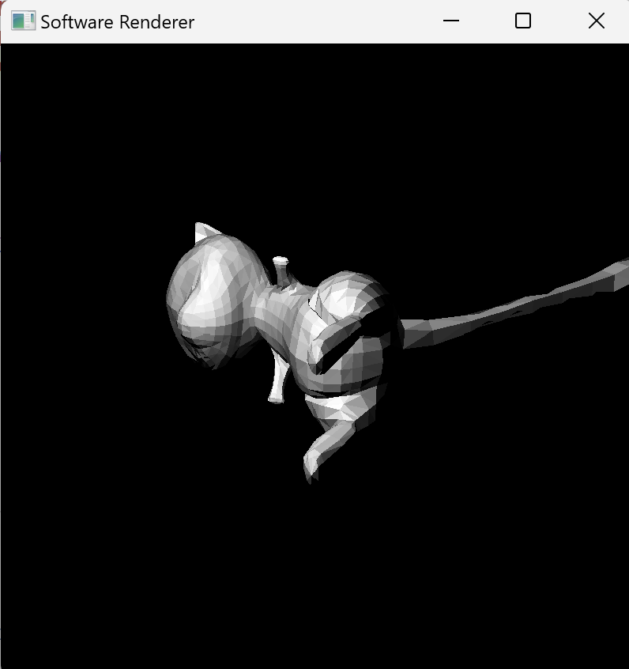
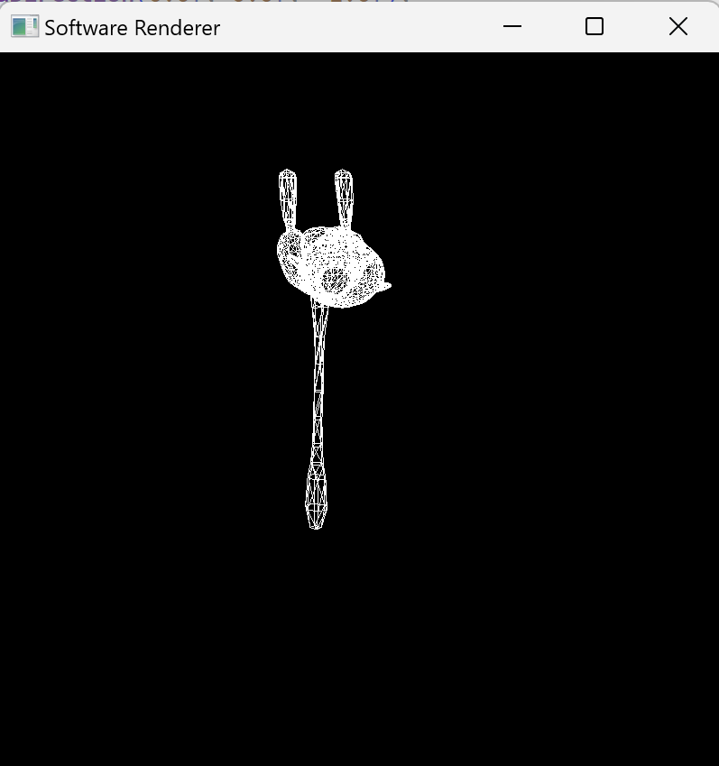
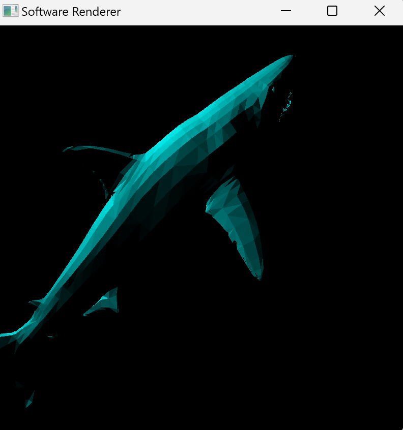
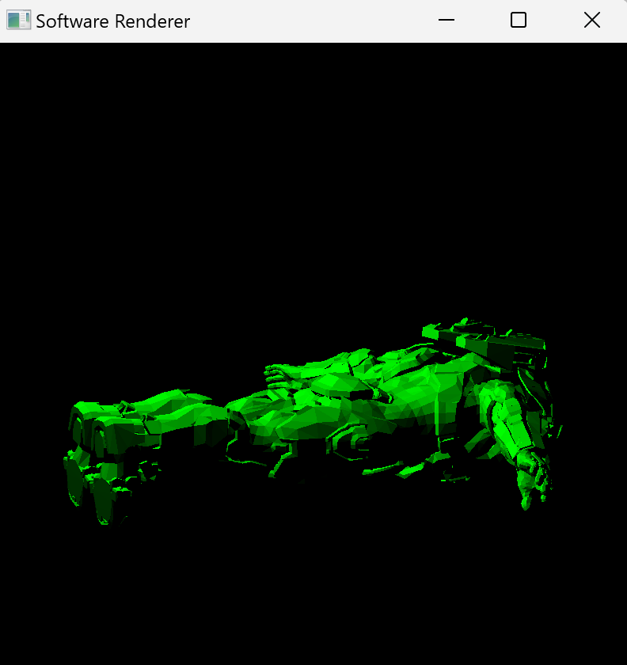

# Software Graphics Pipeline

This is a quick toy example of a software graphics pipeline, implmented in C++. The only library that is included is SFML for immediate mode triangle drawing. Particularly, this project is to demonstrate manual Model, View, Projection transformations.


## Setup

### Windows

```
mkdir build
cmake -S . -B build
cmake --build build
```

Run the executable 

` .\build\bin\Debug\main.exe`


OR 

Open the .sln file in Visual Studio and run it there.

### Others

Should be the same? 

```
mkdir build
cmake -S . -B build
cmake --build build
```

Run the executable 

` .\build\bin\Debug\main.exe`


## Modification
To change the values of the software rasterizer, changes the values at the top of Scene.cpp (in the constructor member initializer list).

```cpp
Scene::Scene() :  
    m_lightPosition(1.0f, 0.0f, 0.0f),
    m_cameraPosition(0.0f, 0.0f, -15.0f),
    m_cameraDirection(0.0f, 0.0f, -1.0f),
    m_modelPosition(9.0f, -5.0f, 0.0f),
    m_modelXRotation(40.0f),
    m_modelYRotation(190.0f),
    m_modelZRotation(90.0f),
    m_scale(1.0f),
    m_fov(45.0f),
    m_near(0.1f),
    m_far(200.0f),
    m_matColor(1.0f, 1.0f, 1.0f)
{
    m_modelXRotation = radians(m_modelXRotation);
    m_modelYRotation = radians(m_modelYRotation);
    m_modelZRotation = radians(m_modelZRotation);
    m_fov = radians(m_fov);
}
```

To change the model, you must change the file path at the top of `EntryPoint.cpp`

```cpp
scene.loadScene(std::string("Models/Mew_lp.raw"));
```

## Screenshots



